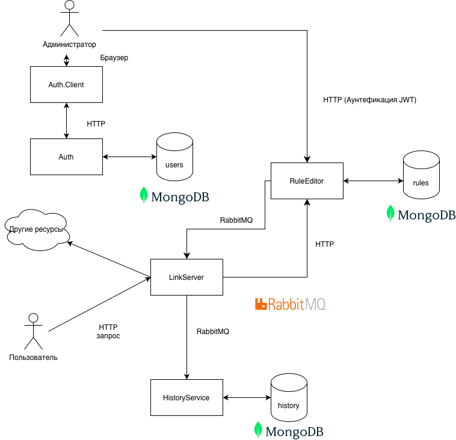

# Умные ссылки
Пользователь переходит по ссылки. В зависимости от набора правил, которые могут включать интервалы времени, местоположение пользователя, устпройство, браузер и др. система выполняет редирект на урл, соответствующий  сработавшему правилу.

## Состав проекта
1. AppHost
2. Auth
3. Auth.Client
4. HistoryService
5. LinkServer
6. LinkServer.Tests
7. RuleEditor
8. RuleEditor.Tests
9. RuleExecutor
10. RuleExecutor.Tests
11. ServiceDefaults
12. ServiceUtils
13. ServiceUtils.Tests

### AppHost
Aspire.Net проект который запускает docker - контейнеры и необходимые сервисы.

### Auth
Сервис для работы с пользователями и выдачей JWT токенов.

### Auth.Client
Frontend сервис для работы с пользователями. Используется Blazor(Web assembly).

### HistoryService
Сохраняет историю выполнения правил.

### LinkServer
Основной сервис который выполняет перенаправление.

### LinkServer.Tests
Тесты для LinkServer

### RuleEditor
Сервис для управления правилами редиректа.

### RuleEditor.Tests
Тесты для RuleEditor

### RuleExecutor
Бизнес логика для обработки правил.

### RuleExecutor.Tests
Тесты для RuleExecutor

### ServiceDefaults
Вспомогательная библиотека для Aspire.Net

### ServiceUtils
Общая логика для сервисов

### ServiceUtils.Tests
Тесты для ServiceUtils

## Диаграмма